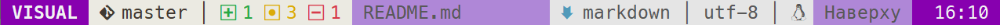
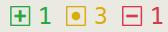

## ℹ️  Info
zRlicense](https://img.shields.io/github/license/hoob3rt/lualine.nvim?style=flat-square)

[Lualine](https://github.com/hoob3rt/lualine.nvim) theme for using with light background.

### 🖼️ newpaper





### 🌟 Features

+ bright colors
+ git native colors in status line

### ⚡️ Requirements

+ Neovim >= 0.5.0

### 📦 Installation

Install via your favourite package manager:
#### [packer.nvim](https://github.com/wbthomason/packer.nvim)
```lua
use 'yorik1984/lualine-theme.nvim'
```

### 🚀 Usage

```lua
require('lualine').setup {
    options = {
        theme = 'newpaper'
    }
}
```

### ⚙️ Configuration

You can add this configuration for customize colors for git and diagnostics:

 
```lua
require("lualine").setup {
    options = {
        theme = "newpaper",
        section_separators = {"", ""}, 
        component_separators = {"│", "│"}
    },
    sections = {
        -- GIT settings
        lualine_b = {
            {"branch", icon = ""},
            {"diff",
                colored = true,
                color_added    = "#28A745",
                color_modified = "#DBAB09",
                color_removed  = "#D73A49",
                symbols = {
                    added    = " ",
                    modified = " ",
                    removed  = " "
                }
            }
        },
        lualine_x = {
            {'diagnostics',
                sources =  {"nvim_lsp"},
                sections = {"error", "warn", "info", "hint"},
                color_error = "#DF0000",
                color_warn  = "#D75F00",
                color_info  = "#0087AF",
                color_hint  = "#008700",
                symbols = {
                    error = " ",
                    warn  = " ",
                    info  = " ",
                    hint  = " "
                }
            }
        }
    }
}
```
